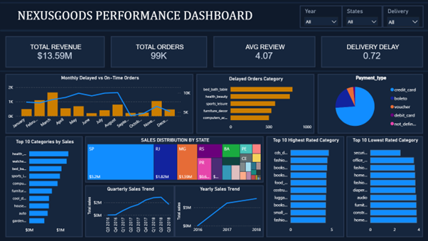

# NexusGoods Performance Dashboard 📊

> **Quick Links:** [📄 View Full Analysis Report (PDF)](NexusGoods_Analysis_Report.pdf) | [📥 Download PBIX File (Google Drive)](https://drive.google.com/file/d/1JrjlKfjgxa5rMOcCen8ICZhU_2yVYCDe/view?usp=sharing)

## 🖥️ Dashboard Preview

## 📝 Project Summary
This project analyzes sales and logistics for **NexusGoods**. I transformed a raw dataset of 99K+ orders into a strategic dashboard to monitor business health.

### 🚀 Key Technical Highlights:
* **Data Modeling:** Connected 5+ relational tables to enable deep-drill analysis.
* **DAX Formulas:** Created custom measures for Profit Margin, YoY Growth, and Delivery Latency.
* **Business Insights:** The analysis revealed that **Health & Beauty** is the top-performing category, contributing significantly to the $13.59M total revenue.

---
*Note: The full .pbix file is hosted on Google Drive due to GitHub's file size limits.*
